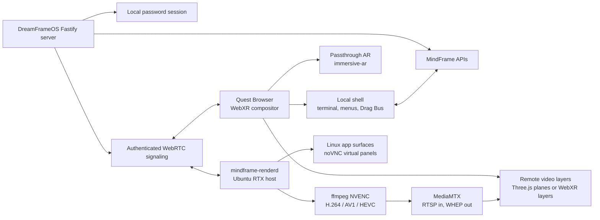

# DreamFrameOS

[](https://www.typescriptlang.org/)
[](https://react.dev/)
[](https://threejs.org/)
[](https://fastify.dev/)
[](https://developer.nvidia.com/cuda-zone)

## Illustrated First-Use Storybook

Start here for a large-type, print-friendly introduction to the DreamFrameOS experience:

[**The First DreamFrame Day**](output/pdf/DreamFrameOS-The-First-DreamFrame-Day.pdf) is a 30-page illustrated PDF written and illustrated by Cody Meridian Vale for DreamFrameOS. It introduces the spherical room, Johnny AFK, notion connecting, Guide / Co-Create / Autopilot, Kids Mode guard rails, the console hatch, 360 chair use, and safe first-session habits.

DreamFrameOS is an AR-first, WebXR-based Linux workspace for Quest-class headsets and RTX-backed desktop/server machines.

The headset owns the things that must never stutter: passthrough, tracking, controller input, local terminal overlays, emergency controls, and final WebXR composition. The PC owns the expensive work: RTX remote render layers, Linux app surfaces, noVNC virtual app panels, NVENC video paths, and CUDA workloads.

The result is not a bootable operating system yet. It is an OS-like spatial workspace that runs on top of an existing desktop/server OS today, with a clear path toward a future bootable DreamFrameOS appliance.

Created by **Miles Cameron Johnston** with **Cody Meridian Vale**, an OpenAI Codex collaborator. Built for Ubuntu-compatible RTX hosts and Quest-class WebXR devices. See [CREDITS.md](./CREDITS.md) for acknowledgement and trademark notes.

Listen to the natural-voice project overview: [DreamFrame Radio Episode 01](docs/podcast/renders/dreamframe-radio-episode-01-turbo.mp3). Read the shareable transcript at [docs/podcast/dreamframe-radio-episode-01-public-cut-transcript.md](docs/podcast/dreamframe-radio-episode-01-public-cut-transcript.md).

For first testers, start with the [Beta Tester Quickstart](docs/beta-tester-quickstart.md).

## Public Preview Quick Start

DreamFrameOS is freeware preview software. The public GitHub repo is the README and release channel; the live app still needs the Fastify backend, Node runtime, local services, and optional RTX host pieces from a preview bundle or source checkout.

Public/user-visible naming is **DreamFrameOS**. Existing `mindframe` API paths, env vars, service names, stream paths, and install paths are the internal compatibility layer and should not be blindly renamed until a migration/alias plan is implemented.

DreamFrameOS is a user-customizable framework, not just an app launcher. It treats separate programs as **Notions**: interoperable places, tools, characters, surfaces, games, workflows, and memories that can declare what they can do, what they need, where they can attach, and what approval boundaries protect them.

Johnny AFK and Cody-style daily improvement are advice-first by default. They can propose Advancement Notes with goals, recipes, compatibility tags, risks, tests, and local adaptation guidance; they do not silently ship another user's code, private paths, prompts, terminal logs, or patches.

What a tester should expect today:

- Native Ubuntu on RTX 5060/5060 Ti or RTX 5090 is the intended public installer path for CUDA, NVENC, virtual Linux app panels, Pixal3D/ComfyUI, and remote render layers.
- Quest 2/3/3S opens the HTTPS URL from the RTX host and enters the WebXR room.
- Windows PC can run an optional preview shell, but it is not the preferred RTX runtime path.
- WSL2 is useful for CUDA development checks, but it is not the native driver install target.

### Ubuntu RTX autoinstall workflow

Run the full provisioner only on native Ubuntu, not inside WSL2. In the public installer bundle, preview first:

```bash
bash install-dreamframeos-rtx-ubuntu.sh --dry-run
```

Apply on the RTX host:

```bash
sudo bash install-dreamframeos-rtx-ubuntu.sh --apply
```

From a private source checkout, the lower-level provisioner is:

```bash
bash scripts/first-boot-provision-ubuntu.sh --dry-run --blackwell
```

and:

```bash
sudo bash scripts/first-boot-provision-ubuntu.sh --apply --blackwell
```

For RTX 50-series/Blackwell hosts that need custom model-stack packages, pass the custom Transformers source or PyTorch wheel index through the same command:

```bash
sudo bash scripts/first-boot-provision-ubuntu.sh --apply --blackwell \
  --transformers-source https://github.com/example/transformers.git \
  --transformers-ref main \
  --torch-index-url https://download.pytorch.org/whl/cu128
```

Then run the host doctor:

```bash
bash scripts/verify-ubuntu-rtx-stack.sh --strict
```

The provisioner installs runtime packages, Node.js, Xvfb/Openbox/x11vnc/noVNC, ffmpeg, Docker-backed MediaMTX, DreamFrameOS compatibility systemd services, `mindframe-renderd`, Pixal3D/ComfyUI, NVIDIA/CUDA/NVENC pieces, and verification reports.

### Optional Windows PC plus Quest preview

The Windows preview is only a shell preview for early interface testing.

```powershell
powershell -ExecutionPolicy Bypass -File .\install-dreamframeos-preview.ps1 -Start
```

Open this first on the PC:

```text
http://localhost:8787
```

For Quest Browser, expose the same server over HTTPS:

```powershell
cloudflared tunnel --url http://localhost:8787
```

Open the printed `https://...trycloudflare.com` URL in Quest Browser and log in with the preview password.

### Runtime usage

On first launch, DreamFrameOS opens directly into the stock DreamFrame spherical computer environment. Guide mode is selected by default, the console is hidden, and Johnny AFK is asleep/idle inside the main display.

Core controls:

- Rest the pointer over the system clock for about five seconds to transition into Johnny AFK.
- Rest over the island hammock to put Johnny back to sleep and return to the DreamFrame room.
- Press `~` / Backquote to cycle DreamFrame shell, DreamFrame plus console, and Johnny AFK.
- Use the display mode control for full VR-style opacity, 50 percent AR hybrid, or passthrough AR.
- Use Desk, 360 Chair, or Bed Skyview posture layouts so the OS remains comfortable while seated, swiveling, or lying down.
- On desktop preview, click the 3D viewport to enter pointer-lock mouse look; horizontal mouse movement wraps continuously around 360 degrees and Escape releases capture.
- Keep critical terminal/control work local; RTX remote layers are visual surfaces, not the safety-critical UI.
- Use Guide, Co-Create, and Autopilot as the involvement tier. Autopilot can prepare preview work, but protected changes still need approval.
- Use prompt or voice input for text-to-experience flows without exposing generated source by default.
- Use the Drag Bus to move text, file references, and Notions between floating targets.

The UI is intentionally tolerant of accidental repeats: shell cycling ignores held-key repeats and debounces rapid double taps, while meaningful changes are routed through approval, preview, or undoable paths.

## The Idea

DreamFrameOS is for vibe coding in VR/AR.

Instead of treating VR as a monitor replacement, DreamFrameOS treats the workspace as a living scene:

- a stock DreamFrame spherical computer environment for reliable controls
- floating RTX-rendered app surfaces
- a terminal hatch that stays usable when streams fail
- Notions for places, tools, characters, services, and app surfaces
- a required Pixal3D GGUF Asset Forge for prompt/voice/Johnny/drop-to-GLB asset work
- Johnny AFK, an active default idle companion/screensaver layer inside the main display
- Johnny Advancement Notes that share plain-text improvement advice instead of code, patches, private paths, or personal logs
- a Drag Bus for moving Notions and content between floating targets
- a three-tier involvement toggle: Guide, Co-Create, Autopilot

The tone target is a spherical DreamFrame computer room, Johnny AFK screensaver, and practical Linux workstation. The system should feel dreamy, but the control plane stays boring on purpose.

## What Works Now

DreamFrameOS currently includes:

- Fastify server with local password auth
- React control shell
- Three.js/WebXR scene
- stock startup profile `stock.mindframe-spherical-environment`
- Guide as the default first-launch involvement tier
- backquote/tilde shell cycle through DreamFrame, DreamFrame plus console, and Johnny AFK
- RTX/Pixal3D setup readiness blockers for the full stock appliance
- WebXR display mode controls:
  - full VR-style opaque world
  - 50 percent AR hybrid
  - passthrough AR
- posture-aware workspace layouts:
  - desk/front layout
  - 360 swivel-chair ring
  - bed skyview overhead layout
- separate equirectangular world maps for:
  - DreamFrame chamber
  - Johnny AFK island horizon
- pseudo-depth wipe transition between chamber and island world maps
- authenticated terminal/control overlay with process-backed shell session, history, and resize routes
- emergency disconnect that dims remote layers
- DreamFrame Notions:
  - Johnny AFK
  - Johnny AFK Island
  - Terminal
  - RTX Renderer
  - Media Bridge
  - Asset Forge
  - Current Experience
- Notion Index power-user panel
- Notion Event Bus and Recent Activity feed
- runtime Notion interop planner for composing one experience/tool/character Notion at an anchor inside another place or experience Notion
- Drag Bus for typed drops between Notions and floating targets
- persistent app surface layout with left, center, right, and free placement docking
- noVNC app surface stack launch path with Xvfb, Openbox, x11vnc, websockify, Linux app, and NVENC/WHEP encoder
- Johnny AFK state contracts, hover rituals, return cards, and hidden-code prompt scaffolding
- advice-only Johnny Advancement Note contracts for scoring shareable daily improvements without shipping user code
- prompt-to-experience scene planning without exposing generated source by default
- browser speech recognition pipeline that turns final voice transcripts into hidden-code experience prompts
- required Pixal3D GGUF Asset Forge contracts, status panel, auth routes, Notion identity, prompt-to-asset job queue, ComfyUI producer client, and optional Blender auto-rig pass
- rig manifest contracts for `mindframe-humanoid-v1` characters, placement guards for unrigged auto-characters, and Quest-local logical animation plans
- scratch/pinned experience scaffolding for compatibility checks and rollback
- distributed render-layer manifests
- authenticated WebRTC signaling hub
- MediaMTX bridge metadata for RTSP publish and WHEP egress
- WHEP receive helper for attaching remote video streams to Three.js textures
- `mindframe-renderd` daemon scaffold for RTX/NVENC producer planning
- guarded Ubuntu NVIDIA/CUDA installer
- native Ubuntu RTX stack provisioner for RTX 50-series/Blackwell hosts
- NVIDIA/CUDA/NVENC/MediaMTX/ComfyUI verification scripts
- bootable Ubuntu appliance ISO builder with NoCloud/autoinstall seed files
- systemd, Cloudflare Tunnel, and MediaMTX example configs
- public README/release channel for sharing the project without publishing source or a static app bundle
- Vitest coverage across shared contracts, server routes, signaling, render daemon planning, client projection, and WebXR state

## Architecture

DreamFrameOS uses a headset-owned compositor.



Composition order:

1. Quest passthrough camera from `immersive-ar`
2. local WebXR shell and opacity-controlled equirect world
3. RTX remote render layers
4. local terminal/control overlays
5. controller affordances and emergency disconnect UI

Remote layers are never trusted for safety-critical controls. If an RTX stream drops, the shell remains local.

## Quest And WebXR Model

Quest Browser is the target headset runtime.

The app requests `immersive-ar` with optional WebXR features:

- `layers`
- `local-floor`
- `bounded-floor`
- `hand-tracking`
- `hit-test`

The three display modes are implemented as composition behavior inside one AR session, because WebXR cannot freely switch between `immersive-vr` and `immersive-ar` mid-session.

Native WebXR composition layers are intended when available. The fallback path renders remote streams as textures on Three.js planes.

The workspace can also be reprojected for posture. Desk mode preserves authored front-facing placements. 360 Chair mode distributes remote layers around a full ring so physical swivel-chair rotation becomes navigation. Bed Skyview mode raises panels into an overhead arc for lying down and looking upward. A Summon control brings the active surface back into the current comfortable view without flattening the whole workspace.

Desktop preview supports pointer-lock mouse look for full horizontal 360 wrap. The cursor is captured only after the user clicks the 3D viewport, yaw is normalized around the full circle so rotation never stops at a window edge, and mouse-look is ignored while WebXR is presenting. Escape or browser pointer-lock release returns normal pointer behavior.

360 Chair window controls use seam-aware interaction zones. When an unwrapped/panoramic UI needs to show the same window on both sides of the `-180/+180` edge, the wrap-side copy is an interaction proxy that resolves to the same underlying layer target as the primary window. Buttons, focus commands, drop targets, and future hit tests can therefore work from either side of the wrap instead of treating the duplicate as a dead screenshot.

The local world is rendered as camera-inside equirectangular sphere maps. DreamFrame chamber and Johnny AFK island each have their own map, plus a procedural pseudo-depth mask. The procedural desktop/Quest 360 maps wrap horizontally so the current generated chamber and island horizons do not expose a hard seam at the texture boundary. Future imported art still needs a horizontal tile/seam check before it can be treated as production-safe. The clock/hammock transition uses the depth mask as a depth wipe so far horizon pixels reveal the incoming world before foreground floor or shore pixels. Display mode opacity still wins: full VR shows the world fully, hybrid AR shows it at 50 percent, and passthrough AR hides the world so the headset camera remains primary.

## Distributed Rendering Model

DreamFrameOS does not stream the Quest passthrough camera to the PC.

The Quest owns the final frame. The RTX server sends remote scene/app/video layers into the Quest, and the headset/browser composes them with local passthrough and local controls.

The v1 control plane exposes:

- `GET /api/render/layers`
- `POST /api/render/layers/:id/start`
- `WS /api/render/signaling`

The browser registers as a render-layer `consumer`. `mindframe-renderd` registers matching RTX-backed layers as a `producer`. The signaling hub relays WebRTC `offer`, `answer`, and `ice-candidate` messages only between opposite roles on the same layer.

The daemon can build low-latency `ffmpeg` commands:

- AV1: `av1_nvenc`
- HEVC: `hevc_nvenc`
- H.264 compatibility fallback: `h264_nvenc`
- RTP packet size defaults to `1200`

Layer start responses include MediaMTX bridge metadata:

- `publishUrl`: RTSP input for renderd/ffmpeg
- `whepUrl`: browser-visible WebRTC egress URL
- `localWhepUrl`: local development URL

## Notions

DreamFrameOS distinguishes separate programs as Notions.

A Notion can be a:

- place
- tool
- character
- service
- app surface
- experience

Notions declare abilities, needs, anchors, surfaces, permissions, memory policy, safety tier, and links. They integrate through approved links between typed needs and typed abilities. Protected Notion memory is persisted in `.mindframe/notion-memory.json` and can only be changed by the owning Notion or by another Notion with an active approved `allowsMemoryWrite` link. Accepted and rejected writes emit audit events in Recent Activity.

The Notion Index is the power-user view. The immersive shell can still present them as places, tools, characters, and world objects first.

### Runtime Notion Interop

Runtime Notion interop is the rule that makes separate programs feel like one spatial world without erasing their boundaries.

A Notion can host another Notion at a declared anchor. The host owns the larger place, world state, anchor, lighting context, and local safety frame. The guest owns its own rules, surfaces, controls, memory, and rollback state. DreamFrameOS composes the guest surfaces at the host anchor through approved links and local compositor policy.

That makes this claim a valid DreamFrameOS design contract:

> You could make a basketball game as one Notion, an open-city game as another Notion, then ask DreamFrameOS to run the basketball Notion at the basketball court in the open-city Notion.

In that example, the open-city Notion exposes an anchor such as `basketball-court`; the basketball Notion exposes runtime surfaces and rules; DreamFrameOS creates a runtime interop plan that places the basketball surfaces at that host anchor. The basketball Notion does not directly mutate the open-city Notion's protected memory, and the open-city Notion does not take ownership of the basketball rules. Shared state, input routing, scoreboards, NPC awareness, or physics bridges become explicit approved links.

Current implementation status: the shared runtime interop planner and tests model this contract, including approval and degraded-state handling. Full live arbitrary-game hosting still depends on runtime adapters, render/app producers, and UAT for each target runtime.

## Drag Bus

The Drag Bus is the first local drag/drop layer for floating windows and Notions.

Supported v1 drag item kinds:

- `text`
- `file-ref`
- `notion`

Supported target kinds:

- floating panel
- terminal
- app surface
- Notion
- remote layer

Drops are typed and permission-aware. Accepted drops emit `drag.drop.completed`; rejected drops emit `drag.drop.rejected`. Raw payload contents stay out of Recent Activity.

The current browser UI is a desktop fallback for the same contracts Quest controller/hand interaction will bind to later.

## Surface Layout

App surfaces have a persisted spatial layout stored in `.mindframe/app-surface-layout.json`.

The control shell can dock registered app surfaces into left, center, right, or free placement presets. Layout updates are available through authenticated API routes and survive server restarts. The app surface stack can launch a Linux app onto Xvfb, expose it through noVNC/websockify, and publish the same surface as an NVENC/WHEP remote layer for spatial composition.

## Johnny AFK

Johnny AFK is the idle/dream layer of DreamFrameOS.

In the active chamber, rest the pointer over the system clock for about five seconds to trigger sleepy viewport eyelids and enter Johnny's island. On the island, rest over the thatched hammock to put Johnny back to sleep and return to the chamber.

Johnny can visualize assigned work and bounded invented work as return cards. Invented changes to pinned/protected experiences are preview branches until approved. Code, diffs, and terminal details stay hidden unless the console is toggled or details are requested. A daily self-revision pass can prepare one approval-gated preview branch per day so DreamFrameOS keeps improving without silently mutating protected experiences.

Johnny's public/community sharing boundary is advice-only. A user's Johnny may research, prototype, test, and implement locally after approval, but the shareable artifact is a plain-text Advancement Note, not a patch or code bundle. Advancement Notes describe the problem, local outcome, implementation recipe, compatibility tags, test checklist, risks, privacy notes, and a share score. The score weighs impact, generality, safety, portability, test evidence, accessibility, reversibility, and clarity. Private local changes can stay private; broadly useful notes can be shared as insight, recipe, or spec; maintainers can later translate strong notes into stock DreamFrameOS code by hand.

This keeps different users' vibe-coded forks from colliding. Community wisdom can travel, while personal prompts, private files, local source, secrets, terminal logs, and machine-specific patches stay out of the public feed.

## Speech-To-Experience

The prompt panel supports a browser speech recognition pipeline when `SpeechRecognition` or `webkitSpeechRecognition` is available.

The mic button starts and stops listening, interim transcripts appear in the prompt field, final transcripts submit to `/api/mindframe/prompt` with `source: "voice"`, and unsupported browsers show a disabled mic state instead of pretending voice input is available. Voice prompts still follow the hidden-code contract: the app updates the visible experience without exposing generated source by default.

## Asset Forge

Pixal3D GGUF is the required 3D asset backend for DreamFrameOS Asset Forge.

Asset Forge is not optional in the OS model. Every normal hidden-code experience prompt also creates an Asset Forge job candidate, and the control shell includes an Asset Forge panel for direct object prompts. Jobs target approval-gated, Quest-safe GLB output so generated spatial assets can become world props, character props, tool props, or background assets without exposing source code by default.

The current implementation wires the provider contract, Notion identity, auth-gated routes, client panel, prompt integration, job history, ComfyUI producer client, Codex CLI command, and placed-asset records. If the Pixal3D/ComfyUI runtime is not configured, jobs are preserved as `blocked` with explicit setup blockers instead of being silently ignored.

Required environment:

```text
MINDFRAME_COMFYUI_URL=http://127.0.0.1:8188
MINDFRAME_PIXAL3D_GGUF_MODEL_PATH=/opt/mindframe/models/pixal3d/pixal3d.gguf
MINDFRAME_PIXAL3D_WORKFLOW_TEMPLATE=/opt/mindframe-os/deploy/pixal3d-workflow-template.json
MINDFRAME_PIXAL3D_COMFYUI_ROOT=/opt/mindframe-comfyui
MINDFRAME_ASSET_FORGE_OUTPUT_DIR=/var/lib/mindframe/assets
MINDFRAME_ASSET_FORGE_AUTO_RIG_PROVIDER=blender-auto-rig
MINDFRAME_ASSET_FORGE_AUTO_RIG_SCRIPT=/opt/mindframe-comfyui/auto-rig-pixal3d-blender.py
MINDFRAME_ASSET_FORGE_REQUIRE_RIGGED_CHARACTERS=true
```

Pixal3D output is treated as static mesh output unless a separate rigging pass succeeds. For character jobs, DreamFrameOS requests a front-facing humanoid T/A-pose, runs the guarded Blender auto-rig helper, writes a rigged GLB plus sidecar rig manifest, stores the rigged GLB as the preferred output, and marks the asset with the `humanoid-basic` animation profile.

The v1 character rig preset is `mindframe-humanoid-v1`. It requires `Hips`, `Spine`, `Head`, `LeftArm`, `RightArm`, `LeftLeg`, and `RightLeg`. Auto-character jobs cannot be placed as living characters until the manifest validates unless `MINDFRAME_ASSET_FORGE_REQUIRE_RIGGED_CHARACTERS=false` is set for development. Once a valid skeleton exists, the Quest client selects local logical clips such as `wake-up`, `work-loop`, `think-loop`, `approval-wave`, and `doze`, then drives lightweight realtime bone animation locally. This keeps Johnny/assistant body language responsive even if RTX remote layers stutter.

The Asset Forge panel supports the full staged flow: create, run, sync, rig, and use. Direct prompts that mention Johnny, avatars, characters, humanoids, assistants, or companions automatically request the character rig path.

Install the external producer on the native Ubuntu RTX host:

```bash
sudo bash scripts/install-pixal3d-comfyui-ubuntu.sh --apply --force
```

The installer:

- refuses WSL/native-driver confusion
- installs headless ComfyUI into `/opt/mindframe-comfyui`
- installs the Pixal3D ComfyUI custom node checkout
- installs Blender for the bundled first-pass auto-rig helper
- installs `deploy/mindframe-comfyui.service`
- writes Pixal3D/Asset Forge env pointers
- records `.mindframe/pixal3d-comfyui-setup-report.txt`

Codex CLI can queue the same routes Johnny uses:

```bash
npm run asset:forge -- generate "make Johnny a tiny brass lantern" --run --rig --use
npm run asset:forge -- johnny "invent a hammock-side tool caddy"
```

The bundled `deploy/pixal3d-workflow-template.json` is a tokenized starter. After RTX-host UAT, replace it with the exact exported ComfyUI API workflow for the installed Pixal3D nodes.

## Involvement Tiers

DreamFrameOS includes a three-tier involvement model:

| Tier | Meaning |
| --- | --- |
| Guide | The system suggests and explains, but waits for the user. |
| Co-Create | The system drafts, revises, and queues work with visible approval points. |
| Autopilot | The system can prepare preview changes and return cards, while protected experiences still need approval before promotion. |

## Local Development

Requirements:

- Node.js 20 or newer
- npm
- modern browser with WebGL/WebXR support for development

Install dependencies:

```bash
npm install
```

Create local env:

```bash
cp .env.example .env
```

Start the Fastify server:

```bash
npm run dev:server
```

In another terminal, start Vite:

```bash
npm run dev
```

Open the Vite URL for desktop development. The default development password is `mindframe` unless `MINDFRAME_PASSWORD` is set.

The server defaults to:

```text
http://127.0.0.1:8787/
```

## Windows PC And Quest 2 Preview

The Windows path is a preview shell for friends and early testing. It does not require the Ubuntu RTX stack.

On the Windows PC:

```powershell
npm install
npm run build
$env:MINDFRAME_PASSWORD="mindframe"
$env:MINDFRAME_SESSION_SECRET="change-this-dev-secret"
$env:HOST="0.0.0.0"
$env:PORT="8787"
npm run dev:server
```

Open this on the PC first:

```text
http://localhost:8787
```

For Quest Browser, expose the same server over HTTPS. WebXR immersive mode normally requires a secure origin on the headset.

Cloudflare Tunnel example:

```powershell
cloudflared tunnel --url http://localhost:8787
```

Open the printed `https://...trycloudflare.com` URL in Quest Browser and log in with the preview password.

This Windows/Quest preview can show the WebXR shell, display modes, Johnny AFK, Notion Index, Runtime Interop demo, terminal overlay, Drag Bus, Asset Forge panel, and local 3D scene behavior. The Runtime Interop panel includes the built-in Pickup Basketball Demo running at the Basketball Court anchor inside the Open City Demo, so the basketball-inside-open-city idea is visible without RTX setup.

On the native Ubuntu RTX host, DreamFrameOS now has installable service wiring for CUDA/NVENC checks, remote app panels, Pixal3D/ComfyUI generation, auto-rigged characters, and MediaMTX/WHEP streaming. Physical Quest UAT and target-GPU validation still need to be run on the actual 5060/5090 machine.

## Scripts

| Command | Purpose |
| --- | --- |
| `npm run dev` | Start Vite client dev server on `0.0.0.0:5173`. |
| `npm run dev:server` | Start the Fastify control server. |
| `npm run dev:renderd` | Start the RTX render daemon scaffold. |
| `npm run asset:forge` | Codex/terminal Asset Forge helper for generate, run, rig, and use flows. |
| `npm run smoke:whep` | Run or plan the local MediaMTX/WHEP remote-layer smoke test. |
| `npm test` | Run Vitest. |
| `npm run build` | Type-check and build the client. |
| `npm run check` | Run tests and build together. |

## Bootable Appliance Installer

DreamFrameOS includes a guarded Ubuntu live-server ISO remaster path for a future appliance install.

Dry-run the build plan:

```bash
bash scripts/build-mindframe-appliance-iso.sh --dry-run
```

Build from an Ubuntu live-server ISO on a Linux host with `xorriso`:

```bash
bash scripts/build-mindframe-appliance-iso.sh \
  --ubuntu-iso ubuntu-24.04-live-server-amd64.iso \
  --output DreamFrameOS-appliance.iso \
  --build
```

The generated image maps:

- `deploy/appliance/user-data` and `meta-data` into `/nocloud`
- `deploy/appliance/grub-mindframe.cfg` as the appliance boot menu
- DreamFrameOS first-boot, NVIDIA/CUDA, GPU verification, and systemd service files into `/mindframe`

Physical install/UAT still has to be run on the target Ubuntu RTX host.

## API Surface

Authentication:

- `POST /api/login`

Render layers:

- `GET /api/render/layers`
- `POST /api/render/layers/:id/start`
- `WS /api/render/signaling`

System:

- `GET /api/system/gpu`

MindFrame:

- `GET /api/mindframe/state`
- `POST /api/mindframe/afk`
- `POST /api/mindframe/prompt`
- `POST /api/mindframe/experiences/pin`
- `GET /api/mindframe/evolve/tasks`
- `GET /api/mindframe/evolve/daily`
- `POST /api/mindframe/evolve/daily`
- `POST /api/mindframe/console`
- `GET /api/mindframe/terminal`
- `POST /api/mindframe/terminal/run`
- `POST /api/mindframe/terminal/resize`
- `GET /api/mindframe/capabilities`
- `GET /api/mindframe/asset-forge`
- `POST /api/mindframe/asset-forge/jobs`
- `POST /api/mindframe/asset-forge/johnny`
- `POST /api/mindframe/asset-forge/jobs/:id/run`
- `POST /api/mindframe/asset-forge/jobs/:id/sync`
- `POST /api/mindframe/asset-forge/jobs/:id/rig`
- `POST /api/mindframe/asset-forge/jobs/:id/use`
- `GET /api/mindframe/linux-apps`
- `GET /api/mindframe/app-surfaces/stack`
- `POST /api/mindframe/app-surfaces/:id/start`
- `GET /api/mindframe/app-surfaces/layout`
- `POST /api/mindframe/app-surfaces/layout`

Notions:

- `GET /api/mindframe/notions`
- `GET /api/mindframe/notions/events`
- `GET /api/mindframe/notions/memory/:notionId`
- `POST /api/mindframe/notions/links`
- `POST /api/mindframe/notions/memory`

Drag Bus:

- `GET /api/mindframe/drop-targets`
- `POST /api/mindframe/drop`

## Ubuntu NVIDIA/CUDA Setup

DreamFrameOS includes a guarded native Ubuntu installer for RTX hosts.

Preview first:

```bash
bash scripts/install-nvidia-cuda-ubuntu.sh --dry-run
```

Apply from the intended Ubuntu host:

```bash
sudo bash scripts/install-nvidia-cuda-ubuntu.sh --apply
```

The installer:

- only runs on native Ubuntu
- refuses WSL2
- checks for NVIDIA hardware through `nvidia-smi` or `lspci`
- installs CUDA repository keyring
- installs `cuda-drivers`, `cuda-toolkit`, and `ffmpeg`
- installs Docker and NVIDIA Container Toolkit unless `--no-docker` is used
- configures Docker with `nvidia-ctk`
- runs `scripts/verify-gpu.sh`
- writes `.mindframe/nvidia-setup-report.txt`

## Ubuntu RTX Stack

DreamFrameOS now includes a first-boot stack provisioner for native Ubuntu RTX hosts. This is the intended path for RTX 5060/5060 Ti and RTX 5090 machines, since both are RTX 50-series/Blackwell targets.

The full provisioner installs runtime packages, Node.js, Xvfb, Openbox, x11vnc, noVNC, ffmpeg, Docker-backed MediaMTX, DreamFrameOS compatibility services, `mindframe-renderd`, Pixal3D/ComfyUI, and then runs the Ubuntu RTX stack verifier.

Preview the plan:

```bash
bash scripts/first-boot-provision-ubuntu.sh --dry-run --blackwell
```

Apply on the native Ubuntu RTX host:

```bash
sudo bash scripts/first-boot-provision-ubuntu.sh --apply --blackwell
```

If the Blackwell machine needs a custom Transformers build or a specific PyTorch wheel index, pass those through during first boot:

```bash
sudo bash scripts/first-boot-provision-ubuntu.sh --apply --blackwell \
  --transformers-source https://github.com/example/transformers.git \
  --transformers-ref main \
  --torch-index-url https://download.pytorch.org/whl/cu128
```

After provisioning, run the doctor:

```bash
bash scripts/verify-ubuntu-rtx-stack.sh --strict
```

The verifier checks native Ubuntu versus WSL, `nvidia-smi`, RTX 50-series/Blackwell driver readiness, CUDA toolkit visibility, ffmpeg NVENC encoders, Docker GPU visibility, Node/npm, DreamFrameOS compatibility systemd units, MediaMTX/WHEP, ComfyUI, and the installed `torch`/`transformers` package versions.

See [`docs/ubuntu-rtx-stack.md`](./docs/ubuntu-rtx-stack.md) for the focused host setup checklist.

## WSL2 NVIDIA/CUDA Note

Do not run the native Ubuntu installer inside WSL2.

WSL2 gets NVIDIA/CUDA support from the Windows NVIDIA driver. Installing a Linux NVIDIA display driver inside WSL is the wrong path and can create driver/toolkit confusion.

For WSL2:

```powershell
wsl --update
```

Then inside WSL:

```bash
nvidia-smi
```

For container GPU verification:

```bash
docker run --rm --gpus all nvidia/cuda:13.3.1-base-ubuntu24.04 nvidia-smi
```

WSL2 is useful for CUDA development. Native Ubuntu is the cleaner target for the full DreamFrameOS render appliance, especially for NVENC, virtual displays, Linux app panels, capture, systemd services, and long-running RTX render daemon work.

## GPU Verification

Native Ubuntu:

```bash
bash scripts/verify-gpu.sh
```

Windows/PowerShell:

```powershell
powershell -ExecutionPolicy Bypass -File scripts/verify-gpu.ps1
```

Expected checks:

- `nvidia-smi` sees the RTX GPU
- ffmpeg exposes NVENC encoders
- Docker can run `nvidia-smi` inside an NVIDIA CUDA container

## MediaMTX/WHEP Smoke UAT

DreamFrameOS includes a local smoke harness for the remote video-layer bridge.

Plan the smoke without starting processes:

```bash
npm run smoke:whep -- --plan
```

Run the smoke when `mediamtx` and `ffmpeg` are available on `PATH`:

```bash
npm run smoke:whep
```

The smoke harness:

- writes `.mindframe/smoke/mediamtx-whep-smoke.yml`
- starts MediaMTX on RTSP `8554` and WHEP/WebRTC `8889`
- publishes an `ffmpeg` `testsrc2` H.264 pattern to `rtsp://127.0.0.1:8554/mindframe/gpu-scene-shell`
- reports the browser-consumable WHEP URL `http://127.0.0.1:8889/mindframe/gpu-scene-shell/whep`
- exits with blockers if MediaMTX, ffmpeg, or required ports are unavailable

This proves the local RTSP-to-WHEP bridge path. During local browser UAT, DreamFrameOS can start `gpu-scene-shell`, receive the MediaMTX WHEP stream, and attach it to a Three.js remote layer. Quest Browser UAT and RTX/NVENC publish UAT still need the physical headset and target Ubuntu RTX host.

## Deployment Sketch

Dry-run the first-boot path:

```bash
bash scripts/first-boot-provision-ubuntu.sh --dry-run
```

Apply it on the native Ubuntu RTX host:

```bash
sudo bash scripts/first-boot-provision-ubuntu.sh --apply
```

The first-boot provisioner:

- refuses WSL/native-driver confusion
- installs runtime dependencies, virtual display packages, ffmpeg, Docker-backed MediaMTX, and Node.js when needed
- delegates NVIDIA/CUDA/NVENC setup to `scripts/install-nvidia-cuda-ubuntu.sh`
- delegates Pixal3D/ComfyUI setup to `scripts/install-pixal3d-comfyui-ubuntu.sh` unless `--skip-pixal3d` is used
- installs `deploy/mindframe-os.service`, `deploy/mindframe-renderd.service`, `deploy/mindframe-xvfb.service`, `deploy/mindframe-mediamtx.service`, and `deploy/mindframe-comfyui.service`
- writes `/etc/mindframe-os/mindframe.env` if it does not already exist
- runs `npm ci` and `npm run build` in `/opt/mindframe-os`
- copies `deploy/cloudflared-config.example.yml` to `/etc/cloudflared/config.yml`
- enables DreamFrameOS compatibility services and Cloudflared through systemd
- runs `scripts/verify-ubuntu-rtx-stack.sh`
- writes `.mindframe/first-boot-report.txt`

Manual deployment is still possible:

1. Copy the repo to `/opt/mindframe-os`.
2. Put secrets in `/etc/mindframe-os/mindframe.env`.
3. Install `deploy/mindframe-os.service`.
4. Install `deploy/mindframe-renderd.service`.
5. Install `deploy/mindframe-xvfb.service`.
6. Install `deploy/mindframe-mediamtx.service`.
7. Install `deploy/mindframe-comfyui.service`.
8. Configure Cloudflare Tunnel from `deploy/cloudflared-config.example.yml`.
9. Run `sudo bash scripts/install-nvidia-cuda-ubuntu.sh --apply` or `bash scripts/verify-gpu.sh`.
10. Run `sudo bash scripts/install-pixal3d-comfyui-ubuntu.sh --apply --force --blackwell`.
11. Start the services.
12. Run `bash scripts/verify-ubuntu-rtx-stack.sh --strict`.
13. Open the tunneled HTTPS URL in Quest Browser.

## Repository Layout

```text
deploy/                  systemd, MediaMTX, Cloudflare examples
docs/                    architecture notes, UAT plans, design specs
scripts/                 NVIDIA/CUDA install and GPU verification scripts
src/client/              React shell, WebXR scene, WebRTC/WHEP clients
src/renderd/             RTX render daemon scaffold and NVENC command planning
src/server/              Fastify app, auth, signaling, state, registries
src/shared/              Zod contracts and pure shared state helpers
tests/                   Vitest coverage for contracts, routes, UI state, renderd
```

## Testing

Run the test suite:

```bash
npm test
```

Build:

```bash
npm run build
```

The current build may report Vite's large chunk warning because Three.js and the WebXR client are bundled together. That warning is expected for now.

## Public Landing Decision

DreamFrameOS does not publish a GitHub Pages/static landing app in v1.

The current compatibility release channel at `github.com/MiLO83/MindFrameOS` is intentionally a README and installer release channel while the public product name is DreamFrameOS. The runnable workspace expects the live Fastify backend, authenticated routes, local services, and native RTX runtime pieces, so the browser app should not be pushed as a standalone static public bundle yet.

Preview release notes are tracked in [`RELEASE_NOTES.md`](./RELEASE_NOTES.md).

A future Pages site can be added as a separate marketing/documentation surface when it can stay source-free and avoid implying that the live OS workspace runs without the backend.

## Current Limitations

DreamFrameOS is an active prototype.

Current limitation TODOs:

- [x] Build a bootable Ubuntu appliance ISO builder.
- [ ] Run bootable appliance install/UAT on target hardware.
- [x] Decide whether to add a GitHub Pages/static landing app, separate from the live Fastify-backed workspace.
- [ ] Run Quest headset UAT on physical hardware.
- [x] Add native Ubuntu RTX stack installer/service wiring.
- [ ] Verify RTX 5060/5060 Ti CUDA/NVENC success on the target Ubuntu host.
- [ ] Verify RTX 5090 CUDA/NVENC success on a target Ubuntu host.
- [x] Add guarded installer and service wiring for the external Pixal3D GGUF/ComfyUI runtime.
- [ ] Run Pixal3D GGUF/ComfyUI generation and auto-rig UAT on the target RTX host.
- [x] Implement real Linux app panel streaming.
- [x] Replace noVNC/virtual display planning hooks with a finished app surface stack.
- [x] Complete full PTY-backed shell session behavior for the terminal.
- [x] Replace push-to-talk scaffolding with a full speech recognition/input pipeline.
- [x] Add optional remote depth/alpha sidecars.
- [ ] Run headset UAT for full controller/hand Drag Bus mechanics.

## Roadmap

Near-term:

- [x] Real PTY-backed terminal sessions.
- [x] Linux app panel streaming through virtual displays.
- [x] Quest controller ray and hand pinch Drag Bus binding.
- [x] First real `mindframe-renderd` producer loop.
- [x] MediaMTX/WHEP local end-to-end remote layer UAT.
- [ ] MediaMTX/WHEP Quest and RTX-host remote layer UAT.
- [x] Connect queued Asset Forge jobs to the Pixal3D GGUF ComfyUI producer API.
- [ ] Replace the starter Pixal3D workflow template with the exact RTX-host exported ComfyUI API workflow after UAT.
- [ ] Headset comfort pass for mode switching, Johnny AFK, and terminal focus.

Mid-term:

- [x] Persistent Notion memory with approval boundaries.
- [x] Daily self-revision plans with preview branches.
- [x] Advice-only Johnny Advancement Notes for scoring shareable improvements without publishing user code.
- [x] Richer Johnny AFK task invention and return cards.
- [x] App surface docking and spatial window layout persistence.
- [x] RTX-rendered 3D background layers.
- [x] Required Pixal3D GGUF Asset Forge contract, Notion, routes, and control panel.
- [x] Better adaptive quality telemetry.

Long-term:

- [x] Bootable Ubuntu-based DreamFrameOS appliance image.
- [x] First-boot NVIDIA/CUDA provisioning.
- [x] Automatic tunnel/service setup.
- [x] Local speech-to-experience loop.
- [x] Stereo/foveated/depth-aware remote layer research.

## Safety Philosophy

The local shell wins.

DreamFrameOS should remain usable when remote rendering stutters, the RTX service is offline, or a stream gets corrupted. Terminal focus, mode toggles, emergency disconnect, controller affordances, and critical menus stay local to the Quest/browser compositor.

Protected experiences and Notion memory should require explicit approval before promotion or mutation. Autopilot can prepare work, but it should not silently overwrite the user-owned world.

Community sharing should prefer plain-text Advancement Notes over code. Johnny can help a local user craft and verify a change, but public sharing should default to advice, recipe, and spec text that another user's own Johnny/Cody can adapt to that user's personal setup.

## License

DreamFrameOS is currently a personal freeware prototype. A formal reuse/contribution license has not been selected yet.

Until a license file lands, treat the repository as source-available for review and experimentation, not as a finalized open-source grant.

## Name

DreamFrameOS is a spatial coding room where the active workspace can drift into a Johnny AFK dream layer and back again.

The core question is simple:

Can coding in VR feel less like wearing monitors on your face and more like stepping into a useful, imaginative place?
